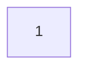

## MSquare Programing Fullstack Course
### Episode-*34* 
### Summary For `Room(1)` intermediate Class
##
### Render in react
- react မှာ အဓိက အားဖြင့် props ပြောင်းတဲ့ အချိန် နဲ့ state ပြောင်းတဲ့ အချိန်တွေမှာ re-renderလုပ်ပေးလေ့ရှိပါတယ်။
##
### State in react
- state ဆိုတာ react component တစ်ခုရဲ့ လက်ရှိအခြေအနေ ကို ဆိုလိုတာဖြစ်ပါတယ်။
- react ကို functional component နဲ့ ရေးတဲ့အခါ state တွေ သုံးလို့ရအောင် hook တွေနဲ့ ချိတ်ပေးရပါတယ်။
- react hook  ဆိုတာကလည်း function တစ်မျိုးလို့ သတ်မှတ်နိုင်ပါတယ်။
##
### useState hook
syntax
`const [ state , set-function] = useState(initialState) `
- **state** ဆိုတဲ့ နေရာမှာ useState ရဲ့ နောက် **(initialState )  ထဲက တန်ဖိုး** ၀င်လာမှာ ဖြစ်ပြီး၊
- **set-function** ကတော့  useState ရဲ့ နောက် **( initialState)  ထဲက တန်ဖိုးကို updateလုပ်တဲ့ function** လို့ အကြမ်းဖျင်းမှတ်သားထားပါ။


### Example code

    const [number ,setNumber] = useState(1)

##
### Using useState() hook in react
- App.js
```js
import "./App.css";
import User from "./components/User";
import config from "./config";
import { useState } from "react";

function App() {
  const [number, setNumber] = useState(1);
  
  return (
    <div className="App">
      <button>{number}</button>
    </div>
  );
}

export default App;

```
---

    import { useState } from "react";

- useState hook ကို သုံးမှာမလို့ import အရင်လုပ်ပေးရပါမယ်

`const [number, setNumber] = useState(1);`
- useState ကို စတင်သတ်မှတ်လိုက်ပါပြီး

```js
  return (
    <div className="App">
      <button>{number}</button>
    </div>
  );
```
- button တစ်ခုကို return လုပ်ထားပြီး button ရဲ့ value name နေရာမှာ useState ထဲ က number (initialState)ရဲ့ တန်ဖိုးကို ထည့်ပေးလိုက်ဖြစ်ပါတယ်။
- npm start နဲ့ react ကို start လိုက်ပါက 

ဆိုပြီး browser မှာ react  က render လုပ်ပေးမှာဖြစ်ပါတယ်။
##
### Update (initialState)
- render လုပ်ထားတဲ့ button ကို click လိုက်တာနဲ့ ပြပေးနေတဲ့ button ရဲ့ value ကို တစ် တိုးသွားအောင်လုပ်ကြည့်ကြပါမယ်။
```js
import "./App.css";
import User from "./components/User";
import config from "./config";
import { useState } from "react";

function App() {
  const [number, setNumber] = useState(1);
  const handleOnClick = () => {
    const newNumber = number + 1;
    setNumber(newNumber);
  };
  return (
    <div className="App">
      <button onClick={handleOnClick}>{number}</button>
    </div>
  );
}

export default App;

```
- button မှာ click event ဖမ်းထားပြီး handleOnClick ကို ခေါ်ထားပါတယ်
- handleOnClick function ထဲမှာ newNumber တစ်ခုသတ်မှတ်ထားပြီး တန်ဖိုးကို useState ရဲ့  မူလတန်ဖိုး (initialState)ကို တစ်ပေါင်းပေးတဲ့ ရလဒ်အဖြစ်သတ်မှတ်ထားပါတယ်။
- ပြီးရင်တော့ useState ရဲ့ set-state function ကို ခေါ်ပြီး မူလတန်ဖိုး (initialState)ကို  newNumberရဲ့ တန်ဖိုး အဖြစ် update လုပ်ပေးလိုက်ဖြစ်ပါတယ်။
- အခု  browser မှာ သွားပြီး button ကို ကလစ်ကြည့်ပါက တစ်ခါ click လိုက်တိုင်း value ကို တစ်တိုးပေးလိုက်တာကို မြင်ရမှာပါ။
##
### useEffect hook
- react component တစ်ခု render လုပ်ပြီးတဲ့ အချိန်မှာ **useEffect** hook ကို react က ခေါ်ပေးလေ့ရှိပါတယ်။
- ဒါကြောင့်မို့လို့ **useEffect** hook  ကို react component တစ်ခု render လုပ်ပြီးတဲ့ အချိန်မှာ တစ်ခြားလုပ်ဆောင်ချက် ဆက်လုပ်ချင်တဲ့အခါကျရင် သုံးလေ့ရှိပါတယ်။
- **useEffect** hook မှာ parameter နှစ်ခု လက်ခံပါတယ်။
### Syntax
```properties
useEffect( setup , dependencies-list)
```
- setup ဆိုတာ ( **callback-function**) တစ်ခုဖြစ်ပြီး၊
- dependencies-list ဆိုတာက **useEffect** အတွက် ထောက်ပံ့ပေးမယ့် **array(list)** တစ်ခုဖြစ်ပါတယ်
### Example
#### App.js
```js
import "./App.css";
import User from "./components/User";
import config from "./config";
import { useEffect, useState } from "react";

function App() {
  const [number, setNumber] = useState(1);
  const handleOnClick = () => {
    const newNumber = number + 1;
    setNumber(newNumber);
  };

  useEffect(() => {
    console.log("log from use effect");
  }, []);

  console.log("log from first render");

  return (
    <div className="App">
      <button onClick={handleOnClick}>{number}</button>
    </div>
  );
}

export default App;

```
- **useEffect hook** ကို အသုံးပြုထားပြီး ပထမ parameterမှာ log တစ်ခုထုတ်ထားတဲ့ callback function ကို ခေါ်ထားပါတယ်
- ဒုတိယ parameter မှာ  empty array တစ်ခုပဲ ထည့်ပေးထားပါတယ်
-  **useEffect hook** အောက် အပြင်မှာ log တစ်ခု ထုတ်ထားပါတယ်
- npm start လုပ်ကြည့်တဲ့အခါမှာတော့ 
- - **useEffect hook** အောက် အပြင်မှာထုတ်ထားတဲ့ log က အရင်ထွက်လာပြီးမှ
- - **useEffect hook** ထဲက log ကို ထုတ်ပေးသွားတာတွေ့ရမှာပါ


- ဆိုလိုတဲ့သဘောက **useEffect hook** ထဲက လုပ်ဆောင်ချက်တွေက render လုပ်ပြီးသွားတဲ့ အချိန်မှ အလုပ်လုပ်တာ ဖြစ်ပါတယ်။

